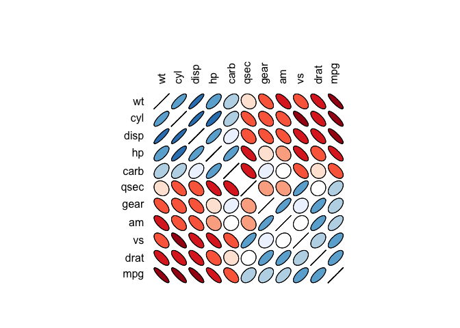

<!-- README.md is generated from README.Rmd. Please edit that file -->

# ellipse

<!-- badges: start -->
<!-- badges: end -->

`ellipse` contains ellipse drawing routines designed for pairwise
confidence regions, including distorted ellipses for nonlinear
regression regions. It also includes a routine `plotcorr()` for plotting
correlation matrices using ellipses.

## Installation

It is on CRAN, and can be installed using

``` r
install.packages("ellipse")
```

You can install the development version of ellipse from
[GitHub](https://github.com/) with:

``` r
# install.packages("devtools")
devtools::install_github("dmurdoch/ellipse")
```

## Example

The `plotcorr()` function can a matrix of ellipses:

``` r
library(ellipse)
#> 
#> Attaching package: 'ellipse'
#> The following object is masked from 'package:graphics':
#> 
#>     pairs
corr.mtcars <- cor(mtcars)
ord <- order(corr.mtcars[1,])
xc <- corr.mtcars[ord, ord]
colors <- c("#A50F15","#DE2D26","#FB6A4A","#FCAE91","#FEE5D9","white",
            "#EFF3FF","#BDD7E7","#6BAED6","#3182BD","#08519C")   
plotcorr(xc, col=colors[5*xc + 6])
```


